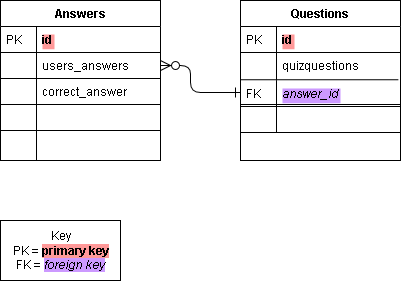

## **CrudQuiz** - An __interactive__ quiz web app.

_In response to the first solo project at QA Consulting._

<!-- ### **Index**

Coming soon! -->

### **The Brief**

Create a web app deployed on a production-ready server that has full CRUD functionality to meet the MVP (_minimum viable product_) without adding any additional functionality until this MVP has been met. Part of the brief is writing documentation (which you are reading now) as well as the use of a project tracking system (in my case Trello) which also utilises the Kanban method.

## Entity Relationship Diagram

## Risk Assessment

[Risk Asessment](https://docs.google.com/document/d/e/2PACX-1vTrfSYyr-DdCGlFeKzCalICBrw_ku0WTiIBZj1q4u_WgoqHw3w1gg_Rl0veIr2TyJh_Sj0YZk62gJ6p/pub) 

To meet the MVP two tables are needed and here a one-to-many relationship is shown between the answer_id row in the Questions table and the user_answers row in the Answers table.

### **Testing**

As per the project brief should be able to run pytest to run tests on my code.

### **Deployment**

 \
Whist the project is currently in development it has not been deployed on a production server, but will be making use Nginx (possibly my favourite ever web server) and Gunicorn (pronounced ‘Gee Unicorn’).

#### **Technologies Used**

*   Python
*   Flask microframework
*   [Git](https://github.com/dreops/crudquiz) - VCS
*   [Trello](https://trello.com/b/0sRfDybn/crudquiz-kanban) - Project Tracking
*   Google Cloud Platform to host every element of the project from VM’s to SQL
*   Gunicorn (will be used)
*   Static IP and DNS (routing my domain quiz.dredevops.com to the static IP)
*   CloudFlare (experimental - which includes a server signed security certificate - will turn off until MVP is met if not initially working).
<!-- *   Brotli (A CloudFlare feature "Speed up page load times for your visitor’s HTTPS traffic by applying Brotli compression.") will only work if https is configured (the port is open due to allowing HTTPS traffic on the VM) and the certificate has been issued on the domain by CloudFlare but the option to always use HTTPS is turned off for now until the MVP has been met and it's working via HTTP)
* If CloudFlare works then a countime timer will also appear on the site, and I wil 
 -->
* Draw.io - for creating ERDs
* Google Drive - cloud based file storage/sharing, backup, file viewer, word processing
* Evernote - local and cloud based note storage

### **Credits**

Project by Andreas Andrews

A huge thanks to trainer Ben, Luke, Matt & Piers as well as the incredibly lovely cohort. \
Additional thanks to Rory, Naomi and all the immensely supportive & wonderful staff and trainees I’m grateful to have met whilst training at QA.

<em> \
Document version<strong>  0.2.0</strong></em>
